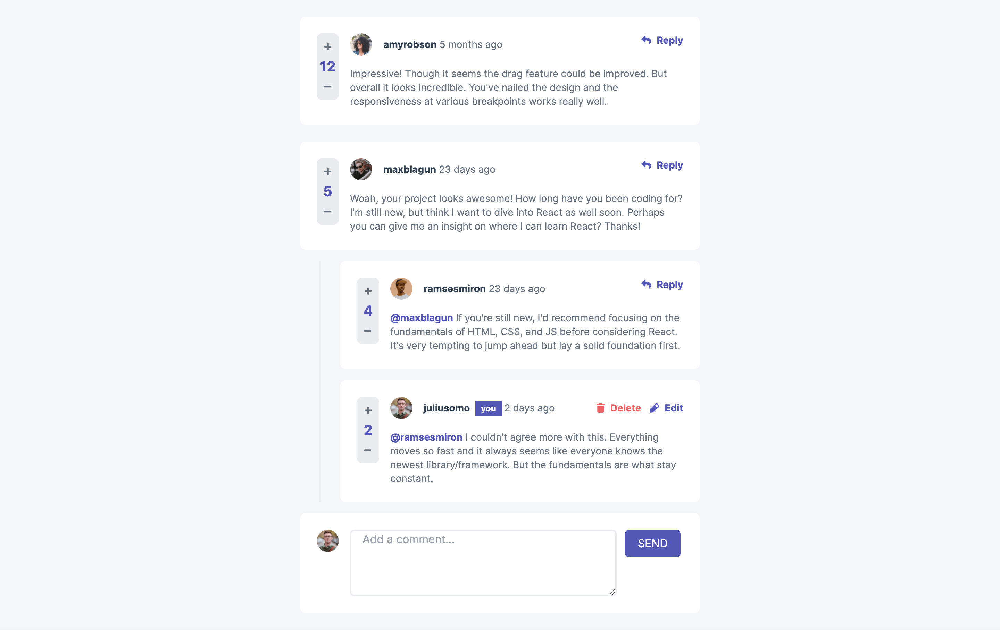

This is a [Next.js](https://nextjs.org/) project bootstrapped with [`create-next-app`](https://github.com/vercel/next.js/tree/canary/packages/create-next-app).

## Getting Started

First, run the development server:

```bash
npm run dev
# or
yarn dev
# or
pnpm dev
```

# Project Description

This is a solution to the [Interactive comments section challenge on Frontend Mentor](https://www.frontendmentor.io/challenges/interactive-comments-section-iG1RugEG9). Frontend Mentor challenges help you improve your coding skills by building realistic projects. 

## Table of contents

- [Overview](#overview)
  - [The challenge](#the-challenge)
  - [Screenshot](#screenshot)
  - [Links](#links)
- [My process](#my-process)
  - [Built with](#built-with)
  - [What I learned](#what-i-learned)
  - [Continued development](#continued-development)
  - [Useful resources](#useful-resources)
- [Author](#author)

## Overview

### The challenge

Users should be able to:

- View the optimal layout for the app depending on their device's screen size
- See hover states for all interactive elements on the page
- Create, Read, Update, and Delete comments and replies
- Upvote and downvote comments
- **Bonus**: If you're building a purely front-end project, use `localStorage` to save the current state in the browser that persists when the browser is refreshed.
- **Bonus**: Instead of using the `createdAt` strings from the `data.json` file, try using timestamps and dynamically track the time since the comment or reply was posted.

### Screenshot



### Links

- Solution URL: [Github repo](https://github.com/Robertron624/interactive-comments)
- Live Site URL: [Netlify Live Site](https://melodic-lamington-1297e9.netlify.app/)

## My process

### Built with

- Semantic HTML5 markup
- CSS custom properties
- Flexbox
- CSS Grid
- Mobile-first workflow
- [React](https://reactjs.org/) - JS library
- [Next.js](https://nextjs.org/) - React framework
- [Tailwind CSS](https://tailwindcss.com/) - For styles
- [DaisyUI](https://daisyui.com/) - Tailwindcss component library
- [TypeScript](https://www.typescriptlang.org/) - For type checking

### What I learned

With this project I learned a lot about state management and how to use zustand with React, it's still my favorite global state management tool. I also learned how to use TypeScript with React and Next.js. I also learned a lot about tailwindcss with Next.js and how to add custom fonts and colors to tailwindcss. I also learned how to use the daisyui component library with tailwindcss for creating the delete comment modal. Finally I learned how to use the localStorage API to save and return the state of the app.

### Continued development

I want to keep using Next.js for creating mid-large projects that require routing, I prefer pure css or scss but I want to keep learning tailwindcss since it speeds up the styling process. I also want to keep using zustand for global state management and I want to keep using TypeScript for type checking since the industry is going this way. Finally I want to convert this project into a fullstack project with a backend and database.

### Useful resources

- [How to setup Vue & Tailwindcss with Google Fonts and HSL color palette](https://medium.com/@saulchelewani/how-to-setup-vue-tailwindcss-with-custom-fonts-and-hsl-color-palette-cda43bf64fea#:~:text=According%20to%20Tailwind%20docs%2C%20we,color%20palette%20the%20framework%20offers.&text=We%20are%20taking%20that%20customization,Hue%2DSaturation%2DLightness) - This helped me to add custom fonts and colors to tailwindcss.

- [Tailwind css official docs](https://tailwindcss.com/docs/) - This is essential for learning tailwindcss.

- [Tailwind responsive design](https://tailwindcss.com/docs/responsive-design) - This helped me to make the site responsive with tailwind that follows the mobile-first design.

- [DaisyUI - Modal](https://daisyui.com/components/modal/) - This is a tailwindcss component library that I used to style the remove comment modal.

## Author

- Personal Website - [Robert Ramirez](https://robert-ramirez.netlify.app)
- Frontend Mentor User- [@Robertron624](https://www.frontendmentor.io/profile/Robertron624)
- Twitter - [@robertdowny](https://www.twitter.com/robertdowny)

# Fullstack version

## Cloud database

I will be using firebase for the database and authentication.


